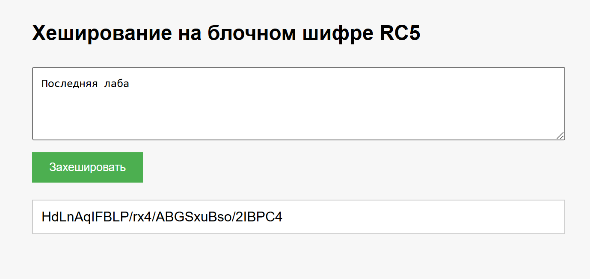
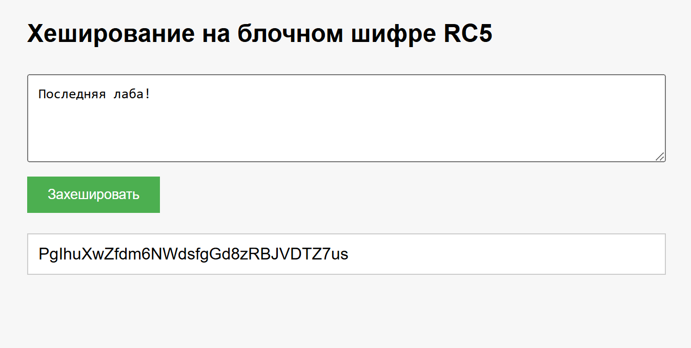
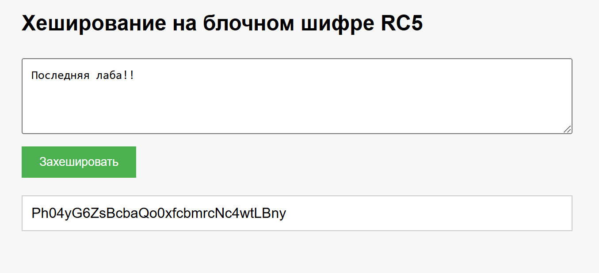

# Хеширование на основе блочного шифра RC5

## Описание
Этот проект представляет собой учебное приложение, демонстрирующее хеширование на основе блочного шифра RC5. Он включает в себя веб-интерфейс и серверную часть, обрабатывающую запросы.

## Краткое описание метода шифрования RC5
RC5 — это симметричный блочный шифр, разработанный Роном Ривестом в 1994 году. Он использует переменное количество раундов, размер блока и длину ключа, что делает его гибким и адаптируемым. В данном проекте используется RC5 с 32-битными словами, 12 раундами и 16-байтовым ключом. Шифр включает в себя операции сложения, XOR и циклических сдвигов для обеспечения безопасности.

## Структура проекта
- **Handlers/**
  - `WebSocketHandler.cs`: Обработчик WebSocket-соединений.
- **Models/**
  - `RequestMessage.cs`: Модель запроса.
  - `ResponseMessage.cs`: Модель ответа.
- **Services/**
  - `CipherService.cs`: Сервис для выполнения хеширования.
- **wwwroot/**
  - `index.html`: Главная страница веб-приложения.
  - `script.js`: Скрипты для взаимодействия с сервером.
  - `style.css`: Стили для веб-приложения.
- `Program.cs`: Точка входа в приложение.
- `Startup.cs`: Конфигурация приложения.

## Запуск проекта
Для запуска проекта выполните следующие шаги:

1. Убедитесь, что у вас установлен .NET 8.0 SDK.
2. Откройте терминал и перейдите в корневую директорию проекта.
3. Выполните команду:
    ```sh
    dotnet run
    ```
4. Откройте браузер и перейдите по адресу `http://localhost:5000`.

### Что можно сделать в веб-интерфейсе?
1. Ввести текст для хеширования
2. Получить хешированный текст

## Скриншоты того, что для схожих сообщений хеш разный

### 1


### 2


### 3

